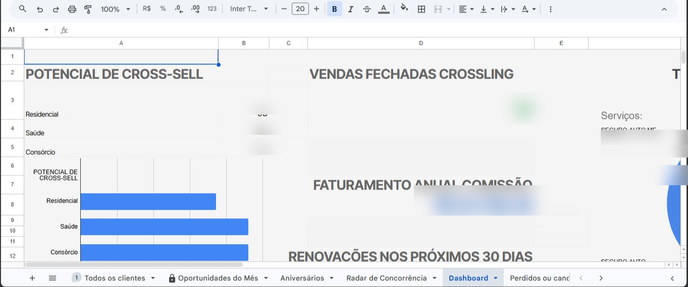
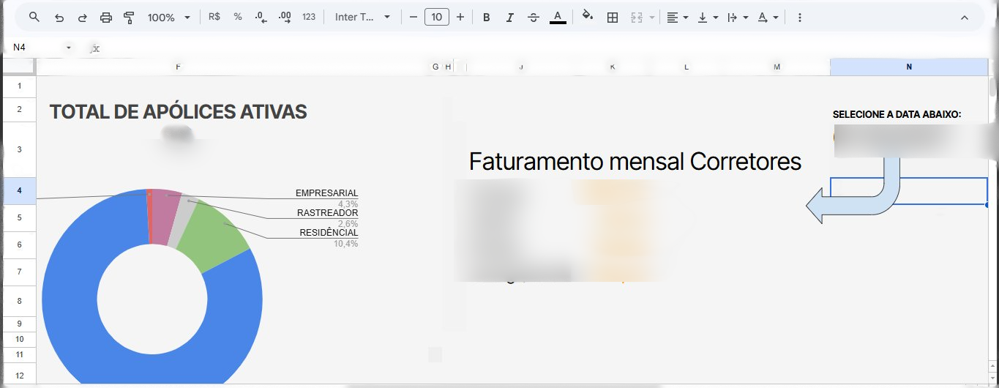

# 📊 Planilha Inteligente — SRS Corretora

Sistema completo de gestão de clientes construído no Google Sheets com automações em Google Apps Script.

---

## 🗂️ Abas da Planilha

| Aba | Função |
|---|---|
| Todos os clientes | Banco de dados completo com apólices, vencimentos e alertas de cores automáticos |
| Oportunidades do Mês | Cross-sell inteligente com sistema de score de prioridade e régua de relacionamento |
| Aniversários | Aniversariantes do mês atual gerados automaticamente |
| Radar de Concorrência | Monitoramento de anúncios e estratégias dos concorrentes |
| Dashboard | Visão geral da carteira com faturamento, gráficos e renovações |
| Perdidos ou cancelados | Histórico de apólices não renovadas com motivo da perda |
| Historico de Apolices | Registro permanente de todas as renovações e cancelamentos — nada é apagado jamais |

---

## ⚙️ Automações (Google Apps Script)

### 🔔 Alerta de Renovação (`alerta-renovacao.gs`)
- Roda automaticamente todo dia via gatilho programado
- Verifica apólices com vencimento em **15 dias**
- Envia e-mail automático para o corretor responsável com dados completos do cliente e **link direto para o WhatsApp**
- Marca a coluna P como `ENVIADO` para evitar reenvios duplicados
- Cores automáticas: 🔴 Vermelho = vencida · 🟡 Amarelo = vence em 15 dias

### 🎂 Alerta de Aniversário (`alerta-aniversario.gs`)
- Verifica diariamente os aniversários dos clientes
- Envia e-mail automático para o corretor com **link direto para o WhatsApp do cliente**
- Fortalece o relacionamento e gera indicações

### ⚡ Organização e Comissão Automática (`organizacao-e-comissao.gs`)
- Preenche e-mail do corretor automaticamente ao selecionar o nome
- Calcula comissão automaticamente ao informar prêmio e percentual

### 🔄 Renovação com Histórico (`renovacao-historico.gs`)
- Adiciona o menu **"Corretora"** na barra superior da planilha
- Na renovação: arquiva a apólice antiga na aba **Historico de Apolices** com status `RENOVADA` (verde) e atualiza a linha com os novos dados — sem apagar nada
- No cancelamento: arquiva com status `CANCELADA` (vermelho) e move para **Perdidos ou cancelados** com o motivo registrado
- Consulta de histórico: exibe todas as apólices anteriores de um cliente direto na tela
- Recalcula comissão automaticamente após renovação
- Cria a aba **Historico de Apolices** formatada com um clique

### 💬 Régua de Relacionamento (`regua-relacionamento.gs`)
- Envia alertas automáticos para o corretor nos meses **5, 7 e 9** do seguro
- Cada alerta inclui texto sugerido para WhatsApp, personalizado por produto
- Substituição inteligente: se o cliente já tem o produto do mês, oferece o próximo da fila
- Controla fases via coluna **"Fase da Régua"** na aba Oportunidades — nunca envia duplicado
- Organiza a aba Oportunidades com menu suspenso de status

| Mês | Gatilho | Produto oferecido |
|---|---|---|
| 5 | 210 dias antes do vencimento | Residencial (ou Consórcio se já tiver residencial) |
| 7 | 150 dias antes do vencimento | Consórcio |
| 9 | 90 dias antes do vencimento | Saúde / Vida |

### 📊 Resumo Semanal (`resumo-semanal.gs`)
- Enviado toda **segunda-feira às 8h** para todos os corretores cadastrados
- Calcula vendas dos últimos 7 dias pela **data de início da vigência** (vencimento - 1 ano)
- Inclui renovações registradas na semana, clientes com score alto sem abordagem e renovações previstas nos próximos 30 dias

---

## 🏆 Sistema de Score de Oportunidades

Fórmula `ARRAYFORMULA` com `LET` que calcula prioridade de cada cliente automaticamente:

| Situação | Pontos |
|---|---|
| 🔥 Apólice vence esse mês | +3 |
| 📅 Apólice vence mês que vem | +2 |
| 🎂 Aniversário esse mês | +1 |
| ⚠️ Inadimplente | -5 |

**Resultado:** `Score: 4 | 🔥 Vence este mês 🎂 Aniversário`

```excel
=ARRAYFORMULA(SE(A2:A=""; "";
  SEERRO(
    LET(
      venc; SEERRO(PROCV(A2:A; 'Todos os clientes'!A:E; 5; 0); 0);
      nasc; SEERRO(PROCV(A2:A; 'Todos os clientes'!A:Q; 17; 0); 0);
      status; SEERRO(PROCV(A2:A; 'Todos os clientes'!A:O; 15; 0); "");
      pt_venc; SE(venc=0; 0; SE(MÊS(venc)=MÊS(HOJE()); 3; SE(MÊS(venc)=MÊS(DATAM(HOJE();1)); 2; 0)));
      pt_nasc; SE(nasc=0; 0; SE(MÊS(nasc)=MÊS(HOJE()); 1; 0));
      pt_inad; SE(ÉNÚM(LOCALIZAR("INADIMPLENTE"; status)); -5; 0);
      score_total; pt_venc + pt_nasc + pt_inad;
      "Score: " & score_total & " | " &
      SE(pt_venc=3; "🔥 Vence este mês"; SE(pt_venc=2; "📅 Vence mês que vem"; "")) & " " &
      SE(pt_nasc=1; "🎂 Aniversário"; "") & " " &
      SE(pt_inad=-5; "⚠️ INADIMPLENTE"; "")
    ); "Score: 0")
))
```

---

## 💬 Régua de Relacionamento — Fases

A coluna **"Fase da Régua"** na aba Oportunidades controla em qual etapa cada cliente está:

| Status | Significado |
|---|---|
| ⏳ Aguardando Régua | Cliente ainda não entrou em nenhuma fase |
| 🏠 Mês 5: Res. Enviado | Alerta de residencial enviado ao corretor |
| ❌ Res: Não teve interesse | Cliente recusou residencial — registrar manualmente |
| 💰 Mês 7: Cons. Enviado | Alerta de consórcio enviado ao corretor |
| 💰 Mês 5: Cons. Enviado (já tem Res.) | Cliente já tinha residencial — consórcio foi antecipado |
| ❌ Cons: Não teve interesse | Cliente recusou consórcio — registrar manualmente |
| 🏥 Mês 9: Saúde Enviado | Alerta de saúde/vida enviado ao corretor |
| ❌ Saúde: Não teve interesse | Cliente recusou saúde — registrar manualmente |
| ✅ Cross-Sell Fechado! | Venda realizada! |

---

## 🔄 Cross-Sell — Oportunidades do Mês

Identifica clientes com seguro auto que ainda não têm residencial, saúde ou consórcio:

```excel
=SORT(UNIQUE(FILTER('Todos os clientes'!A2:A;
  ÉNÚM(LOCALIZAR("AUTO"; 'Todos os clientes'!B2:B));
  NÃO(ÉNÚM(LOCALIZAR("INADIMPLENTE"; 'Todos os clientes'!O2:O)));
  'Todos os clientes'!A2:A <> ""
)); 1; VERDADEIRO)
```

---

## 🎂 Aniversários do Mês

Filtra e exibe apenas os aniversariantes do mês atual, ordenados por data:

```excel
={ "SEGURADO" \ "TIPO" \ "CORRETOR" \ "SEGURADORA" \ "ANIVERSÁRIO" \ "CELULAR";
  SORT(
    SORTN(
      FILTER(
        {'Todos os clientes'!A2:B \ 'Todos os clientes'!H2:H \
         'Todos os clientes'!M2:M \ 'Todos os clientes'!Q2:Q \
         'Todos os clientes'!N2:N};
        MÊS('Todos os clientes'!Q2:Q) = MÊS(HOJE())
      ); 999999; 2; 1; 1
    ); 5; VERDADEIRO
  )
}
```

---

## 🕵️ Radar de Concorrência

Gera automaticamente links da Biblioteca de Anúncios do Facebook e perfil do Instagram de cada concorrente:

```excel
=ARRAYFORMULA(SE(A2:A<>"";
  "https://www.facebook.com/ads/library/?active_status=all&ad_type=all&country=BR&q="
  & ENCODEURL(A2:A) & "&search_type=keyword_unordered"; ""))

=ARRAYFORMULA(SE(A2:A<>"";
  "https://www.instagram.com/" & MINÚSCULA(SUBSTITUIR(A2:A; " "; "")); ""))
```

**Campos monitorados:** Nome · Link de anúncios · Status · Última verificação · Observações · Instagram · Post campeão · Estilo de atendimento · Resumo da estratégia

---

## 📸 Dashboard




---

## 📁 Estrutura de Arquivos

```
planilha-inteligente/
├── README.md
├── alerta-renovacao.gs           # Alerta 15 dias antes do vencimento
├── alerta-aniversario.gs         # Aviso de aniversário com link WhatsApp
├── organizacao-e-comissao.gs     # Cálculo automático de comissão e e-mail do corretor
├── renovacao-historico.gs        # Menu Corretora + renovação com histórico permanente
├── regua-relacionamento.gs       # Régua de relacionamento mês 5, 7 e 9 + organização Oportunidades
├── resumo-semanal.gs             # Resumo semanal toda segunda-feira às 8h
└── configurar-gatilhos.gs        # Configura todos os gatilhos automáticos (rodar uma vez)
```

---

## 🚀 Como instalar

1. Abra sua planilha no Google Sheets
2. Acesse **Extensões → Apps Script**
3. Cole o conteúdo de cada arquivo `.gs` no editor
4. Salve com `Ctrl+S`
5. Execute **`configurarMenu`** → o menu "Corretora" aparece na planilha
6. Execute **`criarAbaHistorico`** → cria a aba de histórico formatada
7. Execute **`corrigirEOrganizarColunas`** → organiza a aba Oportunidades
8. Execute **`configurarGatilhos`** → ativa todas as automações diárias e semanais
> ⚠️ O passo 8 só precisa ser feito **uma única vez**. Os gatilhos rodam automaticamente a partir daí.Parte do projeto [automatizando-corretora-do-zero](https://github.com/luquette-dev/automatizando-corretora-do-zero)*
